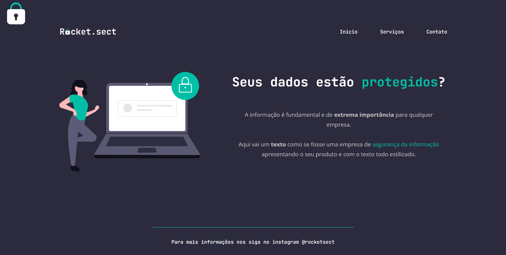

<h1 align="center">Rocket Sect - website</h1>

## 📋 Descrição do projeto

A <strong>Rocket Sect</strong> é um website desenvolvido como desafio da Trilha Explorer da <a href="https://www.rocketseat.com.br/">@Rocketseat</a>. Baseado nos dois projetos anteriores, este website é a união e aplicação de todos os conhecimentos abordados no stage 02 sobre introdução ao <em>HTMl</em> e <em>CSS</em>.

>🔗 [clique aqui para visualizar](https://nathxrz.github.io/TrilhaExplorer-Projeto-Desafio-stage-02/)

 

## 🛠️ Tecnologias
- HTML
- CSS

 

## 📩 Contato
> 📧 nathyrezendemachado@gmail.com  
> 💼 <a href="https://www.linkedin.com/in/nathalia-machado-021b1b230/"> LinkedIn</a>  

    